# Grafo completo de dependências

**Version**: 1.0.0  
**Baseline**: 2026-07-13  
**Coverage**: 34 nós e 163 arestas

Este documento é a renderização humana de [dependency-graph.yaml](dependency-graph.yaml). O YAML permanece a fonte executável; a tabela abaixo preserva cada aresta, tipo e razão.

## Grafo dirigido

```mermaid
flowchart LR
  FND_001["FND-001"] -->|STARTS_AFTER| BC_002["BC-002"]
  FND_001["FND-001"] -->|CONTRACT_ONLY| BC_003["BC-003"]
  BC_002["BC-002"] -->|CONTRACT_ONLY| BC_003["BC-003"]
  FND_001["FND-001"] -->|CONTRACT_ONLY| BC_004["BC-004"]
  BC_002["BC-002"] -->|CONTRACT_ONLY| BC_004["BC-004"]
  FND_001["FND-001"] -->|CONTRACT_ONLY| BC_005["BC-005"]
  BC_003["BC-003"] -->|CONTRACT_ONLY| BC_005["BC-005"]
  BC_002["BC-002"] -->|CONTRACT_ONLY| BC_007["BC-007"]
  BC_003["BC-003"] -->|CONTRACT_ONLY| BC_007["BC-007"]
  BC_003["BC-003"] -->|FINISHES_AFTER| BC_008["BC-008"]
  BC_004["BC-004"] -->|FINISHES_AFTER| BC_008["BC-008"]
  BC_005["BC-005"] -->|FINISHES_AFTER| BC_008["BC-008"]
  BC_007["BC-007"] -->|FINISHES_AFTER| BC_008["BC-008"]
  BC_002["BC-002"] -->|CONTRACT_ONLY| BC_009["BC-009"]
  BC_003["BC-003"] -->|CONTRACT_ONLY| BC_009["BC-009"]
  FND_001["FND-001"] -->|STARTS_AFTER| X_002["X-002"]
  BC_002["BC-002"] -->|CONTRACT_ONLY| X_002["X-002"]
  BC_003["BC-003"] -->|CONTRACT_ONLY| BC_006["BC-006"]
  BC_004["BC-004"] -->|CONTRACT_ONLY| BC_006["BC-006"]
  BC_005["BC-005"] -->|CONTRACT_ONLY| BC_006["BC-006"]
  BC_009["BC-009"] -->|STARTS_AFTER| BC_006["BC-006"]
  X_002["X-002"] -->|STARTS_AFTER| BC_006["BC-006"]
  BC_003["BC-003"] -->|FINISHES_AFTER| X_001["X-001"]
  BC_004["BC-004"] -->|FINISHES_AFTER| X_001["X-001"]
  BC_005["BC-005"] -->|FINISHES_AFTER| X_001["X-001"]
  BC_006["BC-006"] -->|FINISHES_AFTER| X_001["X-001"]
  BC_007["BC-007"] -->|FINISHES_AFTER| X_001["X-001"]
  BC_008["BC-008"] -->|FINISHES_AFTER| X_001["X-001"]
  BC_009["BC-009"] -->|FINISHES_AFTER| X_001["X-001"]
  BC_002["BC-002"] -->|FINISHES_AFTER| VAL_001["VAL-001"]
  BC_003["BC-003"] -->|FINISHES_AFTER| VAL_001["VAL-001"]
  BC_004["BC-004"] -->|FINISHES_AFTER| VAL_001["VAL-001"]
  BC_005["BC-005"] -->|FINISHES_AFTER| VAL_001["VAL-001"]
  BC_006["BC-006"] -->|FINISHES_AFTER| VAL_001["VAL-001"]
  BC_007["BC-007"] -->|FINISHES_AFTER| VAL_001["VAL-001"]
  BC_008["BC-008"] -->|FINISHES_AFTER| VAL_001["VAL-001"]
  BC_009["BC-009"] -->|FINISHES_AFTER| VAL_001["VAL-001"]
  X_001["X-001"] -->|FINISHES_AFTER| VAL_001["VAL-001"]
  X_002["X-002"] -->|FINISHES_AFTER| VAL_001["VAL-001"]
  BC_003["BC-003"] -->|CONTRACT_ONLY| BC_001["BC-001"]
  X_001["X-001"] -->|FINISHES_AFTER| BC_001["BC-001"]
  X_002["X-002"] -->|CONTRACT_ONLY| BC_001["BC-001"]
  VAL_001["VAL-001"] -->|STARTS_AFTER| BC_001["BC-001"]
  BC_003["BC-003"] -->|CONTRACT_ONLY| BC_010["BC-010"]
  BC_008["BC-008"] -->|FINISHES_AFTER| BC_010["BC-010"]
  BC_009["BC-009"] -->|FINISHES_AFTER| BC_010["BC-010"]
  X_001["X-001"] -->|FINISHES_AFTER| BC_010["BC-010"]
  BC_002["BC-002"] -->|CONTRACT_ONLY| BC_011["BC-011"]
  BC_008["BC-008"] -->|CONTRACT_ONLY| BC_011["BC-011"]
  BC_010["BC-010"] -->|CONTRACT_ONLY| BC_011["BC-011"]
  X_002["X-002"] -->|STARTS_AFTER| BC_011["BC-011"]
  BC_001["BC-001"] -->|FINISHES_AFTER| BC_012["BC-012"]
  BC_009["BC-009"] -->|FINISHES_AFTER| BC_012["BC-012"]
  BC_011["BC-011"] -->|CONTRACT_ONLY| BC_012["BC-012"]
  X_002["X-002"] -->|STARTS_AFTER| BC_012["BC-012"]
  BC_001["BC-001"] -->|CONTRACT_ONLY| X_003["X-003"]
  BC_006["BC-006"] -->|CONTRACT_ONLY| X_003["X-003"]
  BC_007["BC-007"] -->|CONTRACT_ONLY| X_003["X-003"]
  BC_008["BC-008"] -->|CONTRACT_ONLY| X_003["X-003"]
  BC_009["BC-009"] -->|CONTRACT_ONLY| X_003["X-003"]
  BC_010["BC-010"] -->|CONTRACT_ONLY| X_003["X-003"]
  BC_011["BC-011"] -->|CONTRACT_ONLY| X_003["X-003"]
  BC_012["BC-012"] -->|CONTRACT_ONLY| X_003["X-003"]
  X_002["X-002"] -->|STARTS_AFTER| X_003["X-003"]
  VAL_001["VAL-001"] -->|STARTS_AFTER| X_003["X-003"]
  BC_012["BC-012"] -->|FINISHES_AFTER| OPS_001["OPS-001"]
  X_002["X-002"] -->|FINISHES_AFTER| OPS_001["OPS-001"]
  X_003["X-003"] -->|FINISHES_AFTER| OPS_001["OPS-001"]
  VAL_001["VAL-001"] -->|FINISHES_AFTER| OPS_001["OPS-001"]
  BC_001["BC-001"] -->|FINISHES_AFTER| GP_001["GP-001"]
  BC_003["BC-003"] -->|FINISHES_AFTER| GP_001["GP-001"]
  BC_012["BC-012"] -->|FINISHES_AFTER| GP_001["GP-001"]
  X_003["X-003"] -->|FINISHES_AFTER| GP_001["GP-001"]
  BC_002["BC-002"] -->|FINISHES_AFTER| GP_002["GP-002"]
  BC_011["BC-011"] -->|FINISHES_AFTER| GP_002["GP-002"]
  X_001["X-001"] -->|FINISHES_AFTER| GP_002["GP-002"]
  X_003["X-003"] -->|FINISHES_AFTER| GP_002["GP-002"]
  BC_001["BC-001"] -->|FINISHES_AFTER| GP_003["GP-003"]
  BC_011["BC-011"] -->|FINISHES_AFTER| GP_003["GP-003"]
  BC_012["BC-012"] -->|FINISHES_AFTER| GP_003["GP-003"]
  X_001["X-001"] -->|FINISHES_AFTER| GP_003["GP-003"]
  X_003["X-003"] -->|FINISHES_AFTER| GP_003["GP-003"]
  BC_002["BC-002"] -->|FINISHES_AFTER| GP_004["GP-004"]
  BC_003["BC-003"] -->|FINISHES_AFTER| GP_004["GP-004"]
  BC_007["BC-007"] -->|FINISHES_AFTER| GP_004["GP-004"]
  BC_009["BC-009"] -->|FINISHES_AFTER| GP_004["GP-004"]
  BC_011["BC-011"] -->|FINISHES_AFTER| GP_004["GP-004"]
  BC_002["BC-002"] -->|FINISHES_AFTER| GP_005["GP-005"]
  BC_003["BC-003"] -->|FINISHES_AFTER| GP_005["GP-005"]
  BC_004["BC-004"] -->|FINISHES_AFTER| GP_005["GP-005"]
  BC_005["BC-005"] -->|FINISHES_AFTER| GP_005["GP-005"]
  BC_006["BC-006"] -->|FINISHES_AFTER| GP_005["GP-005"]
  BC_007["BC-007"] -->|FINISHES_AFTER| GP_005["GP-005"]
  BC_008["BC-008"] -->|FINISHES_AFTER| GP_005["GP-005"]
  BC_009["BC-009"] -->|FINISHES_AFTER| GP_005["GP-005"]
  BC_010["BC-010"] -->|FINISHES_AFTER| GP_005["GP-005"]
  BC_011["BC-011"] -->|FINISHES_AFTER| GP_005["GP-005"]
  X_001["X-001"] -->|FINISHES_AFTER| GP_005["GP-005"]
  X_003["X-003"] -->|FINISHES_AFTER| GP_005["GP-005"]
  BC_002["BC-002"] -->|FINISHES_AFTER| GP_006["GP-006"]
  BC_004["BC-004"] -->|FINISHES_AFTER| GP_006["GP-006"]
  BC_006["BC-006"] -->|FINISHES_AFTER| GP_006["GP-006"]
  BC_007["BC-007"] -->|FINISHES_AFTER| GP_006["GP-006"]
  BC_008["BC-008"] -->|FINISHES_AFTER| GP_006["GP-006"]
  BC_009["BC-009"] -->|FINISHES_AFTER| GP_006["GP-006"]
  BC_011["BC-011"] -->|FINISHES_AFTER| GP_006["GP-006"]
  X_002["X-002"] -->|FINISHES_AFTER| GP_006["GP-006"]
  BC_004["BC-004"] -->|FINISHES_AFTER| GP_007["GP-007"]
  BC_005["BC-005"] -->|FINISHES_AFTER| GP_007["GP-007"]
  BC_007["BC-007"] -->|FINISHES_AFTER| GP_007["GP-007"]
  BC_008["BC-008"] -->|FINISHES_AFTER| GP_007["GP-007"]
  X_001["X-001"] -->|FINISHES_AFTER| GP_007["GP-007"]
  X_002["X-002"] -->|FINISHES_AFTER| GP_007["GP-007"]
  X_003["X-003"] -->|FINISHES_AFTER| GP_007["GP-007"]
  BC_004["BC-004"] -->|FINISHES_AFTER| GP_008["GP-008"]
  BC_006["BC-006"] -->|FINISHES_AFTER| GP_008["GP-008"]
  BC_007["BC-007"] -->|FINISHES_AFTER| GP_008["GP-008"]
  BC_009["BC-009"] -->|FINISHES_AFTER| GP_008["GP-008"]
  X_002["X-002"] -->|FINISHES_AFTER| GP_008["GP-008"]
  X_003["X-003"] -->|FINISHES_AFTER| GP_008["GP-008"]
  BC_003["BC-003"] -->|FINISHES_AFTER| GP_009["GP-009"]
  BC_006["BC-006"] -->|FINISHES_AFTER| GP_009["GP-009"]
  BC_009["BC-009"] -->|FINISHES_AFTER| GP_009["GP-009"]
  X_002["X-002"] -->|FINISHES_AFTER| GP_009["GP-009"]
  X_003["X-003"] -->|FINISHES_AFTER| GP_009["GP-009"]
  BC_004["BC-004"] -->|FINISHES_AFTER| GP_010["GP-010"]
  BC_006["BC-006"] -->|FINISHES_AFTER| GP_010["GP-010"]
  BC_007["BC-007"] -->|FINISHES_AFTER| GP_010["GP-010"]
  BC_009["BC-009"] -->|FINISHES_AFTER| GP_010["GP-010"]
  X_002["X-002"] -->|FINISHES_AFTER| GP_010["GP-010"]
  X_003["X-003"] -->|FINISHES_AFTER| GP_010["GP-010"]
  BC_003["BC-003"] -->|FINISHES_AFTER| GP_011["GP-011"]
  BC_004["BC-004"] -->|FINISHES_AFTER| GP_011["GP-011"]
  BC_005["BC-005"] -->|FINISHES_AFTER| GP_011["GP-011"]
  BC_006["BC-006"] -->|FINISHES_AFTER| GP_011["GP-011"]
  X_003["X-003"] -->|FINISHES_AFTER| GP_011["GP-011"]
  BC_004["BC-004"] -->|FINISHES_AFTER| GP_012["GP-012"]
  BC_005["BC-005"] -->|FINISHES_AFTER| GP_012["GP-012"]
  BC_008["BC-008"] -->|FINISHES_AFTER| GP_012["GP-012"]
  X_003["X-003"] -->|FINISHES_AFTER| GP_012["GP-012"]
  BC_003["BC-003"] -->|FINISHES_AFTER| GP_013["GP-013"]
  BC_006["BC-006"] -->|FINISHES_AFTER| GP_013["GP-013"]
  BC_009["BC-009"] -->|FINISHES_AFTER| GP_013["GP-013"]
  BC_011["BC-011"] -->|FINISHES_AFTER| GP_013["GP-013"]
  X_003["X-003"] -->|FINISHES_AFTER| GP_013["GP-013"]
  BC_003["BC-003"] -->|FINISHES_AFTER| GP_014["GP-014"]
  BC_009["BC-009"] -->|FINISHES_AFTER| GP_014["GP-014"]
  BC_012["BC-012"] -->|FINISHES_AFTER| GP_014["GP-014"]
  X_002["X-002"] -->|FINISHES_AFTER| GP_014["GP-014"]
  X_003["X-003"] -->|FINISHES_AFTER| GP_014["GP-014"]
  BC_003["BC-003"] -->|FINISHES_AFTER| GP_015["GP-015"]
  BC_008["BC-008"] -->|FINISHES_AFTER| GP_015["GP-015"]
  BC_010["BC-010"] -->|FINISHES_AFTER| GP_015["GP-015"]
  BC_011["BC-011"] -->|FINISHES_AFTER| GP_015["GP-015"]
  X_001["X-001"] -->|FINISHES_AFTER| GP_015["GP-015"]
  X_003["X-003"] -->|FINISHES_AFTER| GP_015["GP-015"]
  BC_003["BC-003"] -->|FINISHES_AFTER| GP_016["GP-016"]
  BC_009["BC-009"] -->|FINISHES_AFTER| GP_016["GP-016"]
  BC_010["BC-010"] -->|FINISHES_AFTER| GP_016["GP-016"]
  BC_011["BC-011"] -->|FINISHES_AFTER| GP_016["GP-016"]
  BC_012["BC-012"] -->|FINISHES_AFTER| GP_016["GP-016"]
  X_001["X-001"] -->|FINISHES_AFTER| GP_016["GP-016"]
  X_003["X-003"] -->|FINISHES_AFTER| GP_016["GP-016"]
```

## Ledger de arestas

|   # | Predecessora | Dependente | Kind             | Razão                                                                              |
| --: | ------------ | ---------- | ---------------- | ---------------------------------------------------------------------------------- |
|   1 | FND-001      | BC-002     | `STARTS_AFTER`   | Mundo e scheduler estendem o kernel, relógio, RNG e snapshots versionados.         |
|   2 | FND-001      | BC-003     | `CONTRACT_ONLY`  | Clubes consomem IDs, datas, regras e persistência determinística da fundação.      |
|   3 | BC-002       | BC-003     | `CONTRACT_ONLY`  | Clubes pertencem a mundos e operam dentro de janelas e temporadas oficiais.        |
|   4 | FND-001      | BC-004     | `CONTRACT_ONLY`  | Jogadores consomem identidade, RNG, ruleset e ciclo determinístico da fundação.    |
|   5 | BC-002       | BC-004     | `CONTRACT_ONLY`  | Desenvolvimento e demografia avançam pelo relógio e pelas temporadas do mundo.     |
|   6 | FND-001      | BC-005     | `CONTRACT_ONLY`  | Staff usa identidade, datas, erros e regras determinísticas comuns.                |
|   7 | BC-003       | BC-005     | `CONTRACT_ONLY`  | Funções, capacidade e contratos de staff são vinculados à estrutura do clube.      |
|   8 | BC-002       | BC-007     | `CONTRACT_ONLY`  | Competições consomem temporada, janelas e calendário autoritativos do mundo.       |
|   9 | BC-003       | BC-007     | `CONTRACT_ONLY`  | Inscrição, fixtures e standings referenciam clubes e elencos elegíveis.            |
|  10 | BC-003       | BC-008     | `FINISHES_AFTER` | O kickoff exige clube, elenco e infraestrutura esportiva válidos.                  |
|  11 | BC-004       | BC-008     | `FINISHES_AFTER` | O runtime consome atributos, disponibilidade, fadiga e saúde dos jogadores.        |
|  12 | BC-005       | BC-008     | `FINISHES_AFTER` | Tática e capacidade operacional consultam staff elegível sem escrita cruzada.      |
|  13 | BC-007       | BC-008     | `FINISHES_AFTER` | A partida precisa de fixture, regras da competição e homologação do resultado.     |
|  14 | BC-002       | BC-009     | `CONTRACT_ONLY`  | Orçamentos e fechamentos financeiros seguem datas e períodos do mundo.             |
|  15 | BC-003       | BC-009     | `CONTRACT_ONLY`  | Contas, orçamento, folha e obrigações pertencem ao clube autoritativo.             |
|  16 | FND-001      | X-002      | `STARTS_AFTER`   | O eventing durável evolui envelopes, IDs e idempotência definidos no kernel.       |
|  17 | BC-002       | X-002      | `CONTRACT_ONLY`  | Ordenação, replay e jobs usam worldId, data lógica, lease e fencing do scheduler.  |
|  18 | BC-003       | BC-006     | `CONTRACT_ONLY`  | Mercado referencia clubes, elencos e autoridade de contratação.                    |
|  19 | BC-004       | BC-006     | `CONTRACT_ONLY`  | Scouting e contratos referenciam identidade e estado autoritativo do jogador.      |
|  20 | BC-005       | BC-006     | `CONTRACT_ONLY`  | Negociação e scouting consultam capacidade do staff pelos contratos públicos.      |
|  21 | BC-009       | BC-006     | `STARTS_AFTER`   | Propostas exigem reserva, liquidação e reconciliação no ledger.                    |
|  22 | X-002        | BC-006     | `STARTS_AFTER`   | Transferências e empréstimos exigem saga, checkpoints e compensação duráveis.      |
|  23 | BC-003       | X-001      | `FINISHES_AFTER` | IA estratégica e de elenco atua sobre commands oficiais do clube.                  |
|  24 | BC-004       | X-001      | `FINISHES_AFTER` | IA consulta jogadores apenas pelas informações e restrições autorizadas.           |
|  25 | BC-005       | X-001      | `FINISHES_AFTER` | Capacidade e papéis do staff limitam as decisões automatizadas.                    |
|  26 | BC-006       | X-001      | `FINISHES_AFTER` | IA de mercado usa as mesmas propostas, guards e contratos do gestor.               |
|  27 | BC-007       | X-001      | `FINISHES_AFTER` | Calendário e competição determinam prioridades e elegibilidade da IA.              |
|  28 | BC-008       | X-001      | `FINISHES_AFTER` | IA de partida emite comandos aceitos pelo único runtime autoritativo.              |
|  29 | BC-009       | X-001      | `FINISHES_AFTER` | Toda decisão automatizada respeita orçamento, reservas e ledger.                   |
|  30 | BC-002       | VAL-001    | `FINISHES_AFTER` | Simulação longa precisa completar temporadas e rollovers sem corrupção.            |
|  31 | BC-003       | VAL-001    | `FINISHES_AFTER` | Os lotes validam evolução e integridade de clubes e infraestrutura.                |
|  32 | BC-004       | VAL-001    | `FINISHES_AFTER` | Bandas demográficas exigem lifecycle, saúde, base e aposentadoria completos.       |
|  33 | BC-005       | VAL-001    | `FINISHES_AFTER` | Mundos longos exigem staff e capacidade operacional consistentes.                  |
|  34 | BC-006       | VAL-001    | `FINISHES_AFTER` | Lotes R-34/R-88 medem mercado, contratos e transferências ao longo do tempo.       |
|  35 | BC-007       | VAL-001    | `FINISHES_AFTER` | Promoção requer competições homologadas, standings e rollover válidos.             |
|  36 | BC-008       | VAL-001    | `FINISHES_AFTER` | Determinismo e bandas esportivas dependem do runtime único de partida.             |
|  37 | BC-009       | VAL-001    | `FINISHES_AFTER` | O gate exige ledger reconciliado e economia dentro das bandas.                     |
|  38 | X-001        | VAL-001    | `FINISHES_AFTER` | Clubes autônomos precisam sustentar simulações longas com decisões reproduzíveis.  |
|  39 | X-002        | VAL-001    | `FINISHES_AFTER` | Replay, projeções e sagas precisam provar idempotência durante os lotes.           |
|  40 | BC-003       | BC-001     | `CONTRACT_ONLY`  | Controle de clube referencia clubes e vagas autoritativos.                         |
|  41 | X-001        | BC-001     | `FINISHES_AFTER` | Entrada e saída transferem controle entre gestor humano e automação.               |
|  42 | X-002        | BC-001     | `CONTRACT_ONLY`  | Reserva, onboarding e troca exigem eventos e processamento idempotente.            |
|  43 | VAL-001      | BC-001     | `STARTS_AFTER`   | O backend multiplayer só avança após o núcleo headless promovível.                 |
|  44 | BC-003       | BC-010     | `CONTRACT_ONLY`  | Torcida, diretoria e reputação são observadas no contexto do clube.                |
|  45 | BC-008       | BC-010     | `FINISHES_AFTER` | Resultados oficiais alimentam satisfação e narrativa sem ceder autoridade.         |
|  46 | BC-009       | BC-010     | `FINISHES_AFTER` | Crises e percepção financeira consomem fatos reconciliados da economia.            |
|  47 | X-001        | BC-010     | `FINISHES_AFTER` | Narrative AI produz decisões explicáveis pelos mesmos contratos autorizados.       |
|  48 | BC-002       | BC-011     | `CONTRACT_ONLY`  | Digest, timeline e relatórios respeitam data lógica e períodos do mundo.           |
|  49 | BC-008       | BC-011     | `CONTRACT_ONLY`  | Histórico e estatísticas consomem resultados oficiais da partida.                  |
|  50 | BC-010       | BC-011     | `CONTRACT_ONLY`  | Inbox e memória registram fatos e comunicações narrativas.                         |
|  51 | X-002        | BC-011     | `STARTS_AFTER`   | Notificações e relatórios reconstruíveis dependem de eventos e projeções duráveis. |
|  52 | BC-001       | BC-012     | `FINISHES_AFTER` | Risco, suporte e sanções exigem identidades, sessões e controle auditáveis.        |
|  53 | BC-009       | BC-012     | `FINISHES_AFTER` | Correções financeiras preservam ledger e passam por aprovação.                     |
|  54 | BC-011       | BC-012     | `CONTRACT_ONLY`  | Suporte e auditoria usam histórico reconstruível e notificações oficiais.          |
|  55 | X-002        | BC-012     | `STARTS_AFTER`   | Quarentena, reprocesso e correções dependem de eventos, DLQ e idempotência.        |
|  56 | BC-001       | X-003      | `CONTRACT_ONLY`  | Clientes consomem conta, sessão, participação e controle oficiais.                 |
|  57 | BC-006       | X-003      | `CONTRACT_ONLY`  | Fluxos de mercado usam commands, queries e erros compartilhados.                   |
|  58 | BC-007       | X-003      | `CONTRACT_ONLY`  | Calendário, inscrição e standings fornecem contratos de leitura e ação.            |
|  59 | BC-008       | X-003      | `CONTRACT_ONLY`  | Experiência de partida consome snapshot, comandos e eventos do runtime único.      |
|  60 | BC-009       | X-003      | `CONTRACT_ONLY`  | Finanças exibem projeções oficiais e enviam intents, sem calcular autoridade.      |
|  61 | BC-010       | X-003      | `CONTRACT_ONLY`  | Clientes apresentam torcida, imprensa e conversas pelos contratos narrativos.      |
|  62 | BC-011       | X-003      | `CONTRACT_ONLY`  | Inbox, timeline, records e relatórios abastecem as telas correspondentes.          |
|  63 | BC-012       | X-003      | `CONTRACT_ONLY`  | Admin e estados bloqueados consomem risco, suporte e auditoria oficiais.           |
|  64 | X-002        | X-003      | `STARTS_AFTER`   | Realtime e recuperação de gaps dependem de sequência e projeções duráveis.         |
|  65 | VAL-001      | X-003      | `STARTS_AFTER`   | Integração autoritativa dos clientes espera o fechamento do núcleo headless.       |
|  66 | BC-012       | OPS-001    | `FINISHES_AFTER` | Prontidão de produção inclui segurança, privacidade, suporte e auditoria.          |
|  67 | X-002        | OPS-001    | `FINISHES_AFTER` | Operação mede filas, DLQ, replay, projeções e entrega realtime.                    |
|  68 | X-003        | OPS-001    | `FINISHES_AFTER` | Produção só promove os clientes após carga, segurança e acessibilidade.            |
|  69 | VAL-001      | OPS-001    | `FINISHES_AFTER` | G1–G8 e os lotes reproduzíveis são evidência bloqueante da promoção.               |
|  70 | BC-001       | GP-001     | `FINISHES_AFTER` | Entrada exige conta, reserva, onboarding e controle oficiais.                      |
|  71 | BC-003       | GP-001     | `FINISHES_AFTER` | A vaga e o clube controlado pertencem ao contexto de clube.                        |
|  72 | BC-012       | GP-001     | `FINISHES_AFTER` | Reserva e entrada aplicam risco e prevenção de duplicidade.                        |
|  73 | X-003        | GP-001     | `FINISHES_AFTER` | O fluxo é demonstrado da criação até a central no cliente.                         |
|  74 | BC-002       | GP-002     | `FINISHES_AFTER` | Catch-up avança o mundo de modo idempotente pela data lógica.                      |
|  75 | BC-011       | GP-002     | `FINISHES_AFTER` | Resumo e pendências vêm de histórico e projeções reconstruíveis.                   |
|  76 | X-001        | GP-002     | `FINISHES_AFTER` | Decisões tomadas na ausência precisam ser explicáveis.                             |
|  77 | X-003        | GP-002     | `FINISHES_AFTER` | O cliente apresenta resumo, prioridades e recuperação de estado.                   |
|  78 | BC-001       | GP-003     | `FINISHES_AFTER` | Abandono, cooldown e novo controle são regras de identidade.                       |
|  79 | BC-011       | GP-003     | `FINISHES_AFTER` | A troca preserva histórico e memória do controle anterior.                         |
|  80 | BC-012       | GP-003     | `FINISHES_AFTER` | Saída e troca respeitam risco, sanções e auditoria.                                |
|  81 | X-001        | GP-003     | `FINISHES_AFTER` | A automação reassume o clube pelos commands oficiais.                              |
|  82 | X-003        | GP-003     | `FINISHES_AFTER` | O cliente demonstra encerramento, cooldown e elegibilidade.                        |
|  83 | BC-002       | GP-004     | `FINISHES_AFTER` | O início ocorre uma vez por temporada e janela oficiais.                           |
|  84 | BC-003       | GP-004     | `FINISHES_AFTER` | Objetivos e elenco inicial pertencem ao clube.                                     |
|  85 | BC-007       | GP-004     | `FINISHES_AFTER` | Calendário e inscrições são abertos pela competição.                               |
|  86 | BC-009       | GP-004     | `FINISHES_AFTER` | Orçamento inicial usa contas e ledger oficiais.                                    |
|  87 | BC-011       | GP-004     | `FINISHES_AFTER` | A abertura publica notificações e relatório da temporada.                          |
|  88 | BC-002       | GP-005     | `FINISHES_AFTER` | A semana avança pelo relógio e scheduler do mundo.                                 |
|  89 | BC-003       | GP-005     | `FINISHES_AFTER` | Gestão semanal altera clube e elenco pelos commands oficiais.                      |
|  90 | BC-004       | GP-005     | `FINISHES_AFTER` | Treino, fadiga, moral e saúde evoluem no ciclo.                                    |
|  91 | BC-005       | GP-005     | `FINISHES_AFTER` | Staff limita e executa atividades semanais.                                        |
|  92 | BC-006       | GP-005     | `FINISHES_AFTER` | Mercado e contratos integram o ciclo de decisões.                                  |
|  93 | BC-007       | GP-005     | `FINISHES_AFTER` | Calendário e competição determinam compromissos da semana.                         |
|  94 | BC-008       | GP-005     | `FINISHES_AFTER` | A partida fecha o compromisso esportivo semanal.                                   |
|  95 | BC-009       | GP-005     | `FINISHES_AFTER` | Finanças registram obrigações e movimentos da semana.                              |
|  96 | BC-010       | GP-005     | `FINISHES_AFTER` | Torcida e narrativa reagem aos fatos da semana.                                    |
|  97 | BC-011       | GP-005     | `FINISHES_AFTER` | Inbox e relatórios consolidam consequências e pendências.                          |
|  98 | X-001        | GP-005     | `FINISHES_AFTER` | Clubes sem gestor concluem o mesmo ciclo pelos mesmos commands.                    |
|  99 | X-003        | GP-005     | `FINISHES_AFTER` | O cliente permite decidir e acompanhar a semana completa.                          |
| 100 | BC-002       | GP-006     | `FINISHES_AFTER` | Rollover usa checkpoints, temporada e scheduler autoritativos.                     |
| 101 | BC-004       | GP-006     | `FINISHES_AFTER` | A virada processa idade, aposentadoria, demografia e base.                         |
| 102 | BC-006       | GP-006     | `FINISHES_AFTER` | Contratos e vínculos são expirados ou renovados na virada.                         |
| 103 | BC-007       | GP-006     | `FINISHES_AFTER` | Homologação, classificação e promoção precedem a próxima temporada.                |
| 104 | BC-008       | GP-006     | `FINISHES_AFTER` | Todos os resultados precisam estar oficiais antes do fechamento.                   |
| 105 | BC-009       | GP-006     | `FINISHES_AFTER` | Prêmios e fechamento econômico passam pelo ledger.                                 |
| 106 | BC-011       | GP-006     | `FINISHES_AFTER` | Relatórios e memória registram o encerramento reconstruível.                       |
| 107 | X-002        | GP-006     | `FINISHES_AFTER` | Saga de rollover garante checkpoints, retry e fan-out idempotentes.                |
| 108 | BC-004       | GP-007     | `FINISHES_AFTER` | Escalação usa jogadores disponíveis e elegíveis.                                   |
| 109 | BC-005       | GP-007     | `FINISHES_AFTER` | Staff e capacidade influenciam preparação e tática.                                |
| 110 | BC-007       | GP-007     | `FINISHES_AFTER` | Fixture e regras da competição enquadram a partida.                                |
| 111 | BC-008       | GP-007     | `FINISHES_AFTER` | O runtime executa decisões e produz o único resultado oficial.                     |
| 112 | X-001        | GP-007     | `FINISHES_AFTER` | IA usa os mesmos comandos de preparação e partida.                                 |
| 113 | X-002        | GP-007     | `FINISHES_AFTER` | Eventos distribuem resultado e consequências sem duplicação.                       |
| 114 | X-003        | GP-007     | `FINISHES_AFTER` | O cliente cobre análise, live, replay e resultado.                                 |
| 115 | BC-004       | GP-008     | `FINISHES_AFTER` | A contratação referencia jogador e informação observável.                          |
| 116 | BC-006       | GP-008     | `FINISHES_AFTER` | Scouting, proposta, contrato e vínculo são autoritativos no mercado.               |
| 117 | BC-007       | GP-008     | `FINISHES_AFTER` | A chegada conclui com inscrição elegível na competição.                            |
| 118 | BC-009       | GP-008     | `FINISHES_AFTER` | Reserva e liquidação conservam valor no ledger.                                    |
| 119 | X-002        | GP-008     | `FINISHES_AFTER` | A saga compensa falhas e entrega efeitos uma vez.                                  |
| 120 | X-003        | GP-008     | `FINISHES_AFTER` | O cliente demonstra descoberta, negociação e conclusão.                            |
| 121 | BC-003       | GP-009     | `FINISHES_AFTER` | Clube vendedor controla elenco e decisão de saída.                                 |
| 122 | BC-006       | GP-009     | `FINISHES_AFTER` | Listagem, negociação e transferência são contratos de mercado.                     |
| 123 | BC-009       | GP-009     | `FINISHES_AFTER` | Liquidação única e reconciliação passam pelo ledger.                               |
| 124 | X-002        | GP-009     | `FINISHES_AFTER` | Saga coordena saída e projeções com idempotência.                                  |
| 125 | X-003        | GP-009     | `FINISHES_AFTER` | O cliente cobre listagem, oferta, aceite e reposição.                              |
| 126 | BC-004       | GP-010     | `FINISHES_AFTER` | Empréstimo preserva identidade e lifecycle do jogador.                             |
| 127 | BC-006       | GP-010     | `FINISHES_AFTER` | Duração, custos, opção e retorno pertencem ao contrato de mercado.                 |
| 128 | BC-007       | GP-010     | `FINISHES_AFTER` | Registro e elegibilidade acompanham clube temporário e retorno.                    |
| 129 | BC-009       | GP-010     | `FINISHES_AFTER` | Custos e opção são reservados e liquidados no ledger.                              |
| 130 | X-002        | GP-010     | `FINISHES_AFTER` | Eventos e saga tornam retorno ou compra determinísticos.                           |
| 131 | X-003        | GP-010     | `FINISHES_AFTER` | O cliente demonstra acordo, acompanhamento e desfecho.                             |
| 132 | BC-003       | GP-011     | `FINISHES_AFTER` | Academia, vagas e promoção pertencem à estrutura do clube.                         |
| 133 | BC-004       | GP-011     | `FINISHES_AFTER` | Geração, potencial, treino e desenvolvimento pertencem ao jogador.                 |
| 134 | BC-005       | GP-011     | `FINISHES_AFTER` | Staff avalia e desenvolve jovens dentro de sua capacidade.                         |
| 135 | BC-006       | GP-011     | `FINISHES_AFTER` | Contrato profissional ou saída usam o mercado autoritativo.                        |
| 136 | X-003        | GP-011     | `FINISHES_AFTER` | O cliente cobre safra, avaliação, promoção e consolidação.                         |
| 137 | BC-004       | GP-012     | `FINISHES_AFTER` | Lesão, diagnóstico, indisponibilidade e retorno são estado do jogador.             |
| 138 | BC-005       | GP-012     | `FINISHES_AFTER` | Equipe médica define capacidade e plano de recuperação.                            |
| 139 | BC-008       | GP-012     | `FINISHES_AFTER` | Ocorrência e elegibilidade de partida integram o runtime.                          |
| 140 | X-003        | GP-012     | `FINISHES_AFTER` | O cliente apresenta diagnóstico, plano e retorno gradual.                          |
| 141 | BC-003       | GP-013     | `FINISHES_AFTER` | Clube possui orçamento, folha e decisões de ajuste.                                |
| 142 | BC-006       | GP-013     | `FINISHES_AFTER` | Contratos geram obrigações financeiras mensais.                                    |
| 143 | BC-009       | GP-013     | `FINISHES_AFTER` | Receitas, pagamentos e fechamento usam ledger balanceado.                          |
| 144 | BC-011       | GP-013     | `FINISHES_AFTER` | Projeções e alertas aparecem em relatórios reconstruíveis.                         |
| 145 | X-003        | GP-013     | `FINISHES_AFTER` | O cliente demonstra fechamento, forecast e ajustes.                                |
| 146 | BC-003       | GP-014     | `FINISHES_AFTER` | Projeto altera estádio, departamentos e capacidade do clube.                       |
| 147 | BC-009       | GP-014     | `FINISHES_AFTER` | Financiamento, reserva, custo e manutenção usam o ledger.                          |
| 148 | BC-012       | GP-014     | `FINISHES_AFTER` | Aprovação, inspeção e auditoria protegem o projeto.                                |
| 149 | X-002        | GP-014     | `FINISHES_AFTER` | Saga coordena obra longa e compensações recuperáveis.                              |
| 150 | X-003        | GP-014     | `FINISHES_AFTER` | O cliente demonstra proposta, andamento e operação.                                |
| 151 | BC-003       | GP-015     | `FINISHES_AFTER` | Diretoria diagnostica e governa o plano de recuperação.                            |
| 152 | BC-008       | GP-015     | `FINISHES_AFTER` | Resultados oficiais formam a queda de desempenho.                                  |
| 153 | BC-010       | GP-015     | `FINISHES_AFTER` | Torcida, imprensa, moral e reputação reagem à crise.                               |
| 154 | BC-011       | GP-015     | `FINISHES_AFTER` | Histórico e relatórios sustentam diagnóstico auditável.                            |
| 155 | X-001        | GP-015     | `FINISHES_AFTER` | IA formula resposta explicável pelos commands permitidos.                          |
| 156 | X-003        | GP-015     | `FINISHES_AFTER` | O cliente apresenta crise, respostas e plano.                                      |
| 157 | BC-003       | GP-016     | `FINISHES_AFTER` | Clube executa medidas e reestruturação sob governança.                             |
| 158 | BC-009       | GP-016     | `FINISHES_AFTER` | Caixa, dívida, restrições e recuperação vêm do ledger.                             |
| 159 | BC-010       | GP-016     | `FINISHES_AFTER` | Torcida, imprensa e reputação reagem sem apagar fatos.                             |
| 160 | BC-011       | GP-016     | `FINISHES_AFTER` | Alertas, timeline e relatórios preservam a memória da crise.                       |
| 161 | BC-012       | GP-016     | `FINISHES_AFTER` | Sanções, suporte e correções passam por auditoria.                                 |
| 162 | X-001        | GP-016     | `FINISHES_AFTER` | IA escolhe medidas auditáveis sem privilégios ocultos.                             |
| 163 | X-003        | GP-016     | `FINISHES_AFTER` | O cliente demonstra alerta, restrições e reestruturação.                           |

## Semântica

- `STARTS_AFTER`: predecessor concluído antes do início.
- `FINISHES_AFTER`: desenho pode avançar, mas conclusão espera predecessor.
- `CONTRACT_ONLY`: trabalho paralelo começa apenas após contrato congelado.
- Toda aresta participa da detecção de ciclo; kind não remove dependência topológica.
